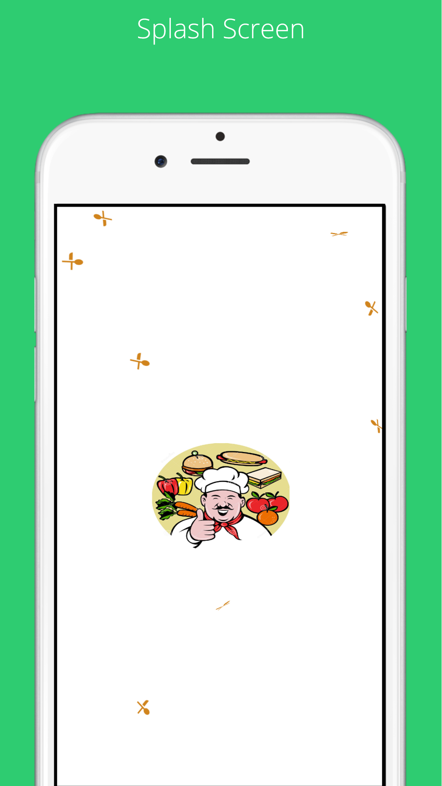
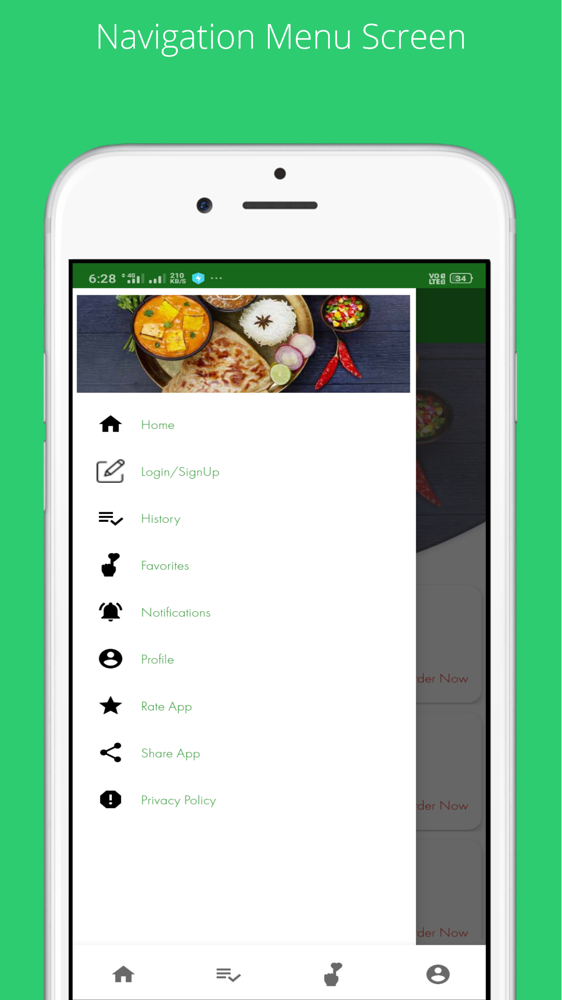

# Tiffy_Tiffin_Service_Provider_App
Full Source Code for ordering tiifin online.

  

<table style="width:100%">
  <tr>
    <th>Screen 1</th>
    <th>Screen 2</th>
    <th>Screen 3</th>
    <th>Screen 4</th>
    <th>Screen 5</th>
    <th>Screen 6</th>
    <th>Screen 7</th>
    <th>Screen 8</th>
  </tr>
  <tr>
    <td></td>
    <td></td> 
    <td></td>
     <td></td>
     <td></td>
     <td></td>
     <td></td>
     <td></td>
  </tr>
</table>

Google Ply Store url
https://play.google.com/store/apps/details?id=logic.mania.tiffy&hl=en
